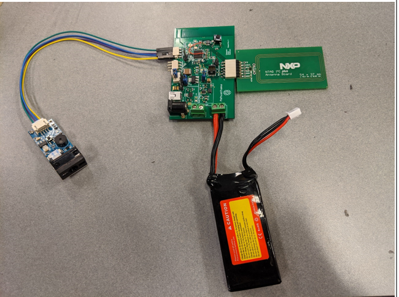
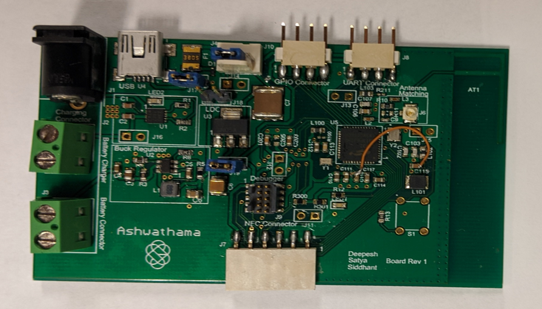
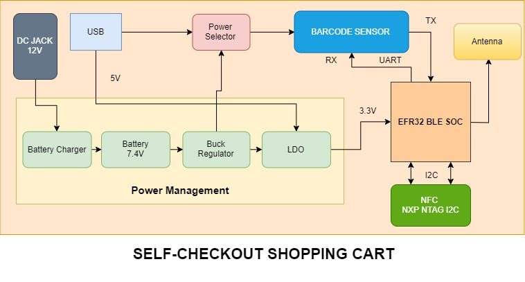
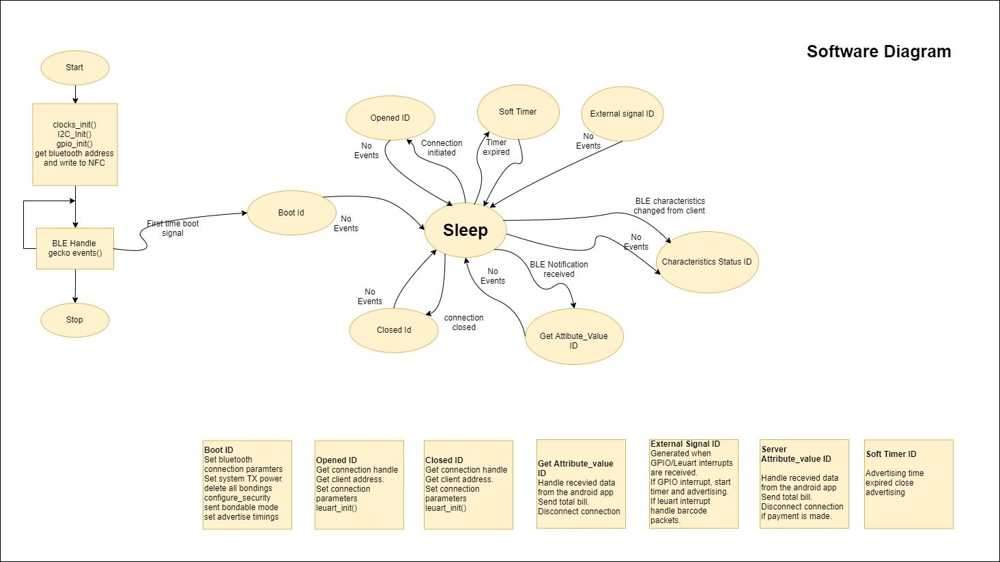

# Self-Checkout-Shopping-Cart

This project was completed in the course Low Power Embedded Design Techniques at University of Colorado, Boulder under the guidance of Prof. Timothy Scherr and Prof. Randall Spalding during September 2019 - December 2019.  

## Hardware Components:
- Blue Gecko EFR32BG13 ([datasheet](https://www.silabs.com/documents/public/data-sheets/efr32bg13-datasheet.pdf))
- NXP NTAG NFC Module ([datasheet](https://www.nxp.com/docs/en/data-sheet/NT3H2111_2211.pdf))
- Barcode Scanner ([datasheet](https://www.waveshare.com/w/upload/3/3c/Barcode_Scanner_Module_User_Manual_EN.pdf))
- Lipo Lithium ion battery ([datasheet](https://cdn.sparkfun.com/datasheets/Prototyping/Lithium%20Ion%20Battery%20MSDS.pdf))
- Buck Converter - TPS560430XFDBVR ([datasheet](http://www.ti.com/general/docs/suppproductinfo.tsp?distId=10&gotoUrl=http%3A%2F%2Fwww.ti.com%2Flit%2Fgpn%2Ftps560430))
- LDO - LM117 ([datasheet](http://www.ti.com/lit/ds/symlink/lm1117.pdf))
- Battery Charging Management IC - MCP73213 ([datasheet](http://ww1.microchip.com/downloads/en/devicedoc/20002190c.pdf))
- Antenna
- Resistors
- Capacitors
- Inductors
- Adapter Jack
- Micro usb connector
- Debbugger

## Software Components:
- Simplicity Studio
- Android Application

## Features:
- The device connects to an Android app via Bluetooth, with NFC used to perform fast and secure pairing/authentication.

- A barcode module scans QR codes and barcodes to retrieve product details such as name and price through the Low Energy UART peripheral on the EFR32BG13.

- The scanned product information is transmitted to the Android application over BLE using the onboard antenna.

- The Android app displays the list of scanned items along with the total cost in the cart.

- The barcode scanner operates at 5V, while the NFC module requires 3.3V, provided through a buck converter and an LDO regulator respectively.

- The device is powered by a rechargeable battery, supported by an onboard battery-management circuit. A 12V adapter supplies stable power for charging the 7.4V battery.

- A debugger interface is included for flashing firmware and accessing debug print statements (VCOMM).

- Multiple test points and isolation points are placed on the PCB to assist during debugging.

- The board can also receive power from alternative sources through USB.

## Block Diagram:

### Hardware Block Diagram

### Software Block Diagram

## Overview:
The “Self-Checkout Shopping Cart” is an innovative consumer purchasing product that is designed to help shoppers fast-track their shopping experience! The shopping cart has an inbuilt barcode scanner which can be used to scan the items to be purchased. The device communicates with the phone over the Bluetooth and bill is generated based on the items. Android app can be used for payment and faster checkout. With the advent of energy efficient devices and low power nodes, it has become imperative to design boards that consume low power which can last longer. To that end, we are designing nodes in order to consume minimal energy and address the issues mentioned below.

PROJECT SOLVES THE FOLLOWING PROBLEMS
1.	Customers usually get annoyed because of the long queues in the billing section of the huge shopping markets. 
2.	In addition to that keeping track of all the bills and budget is a very burdensome task.
3.	Usage of lot of manpower in large supermarkets which can be expensive.
4.	Stock management in supermarkets.
All these problems could be addressed by our “Self-Checkout Shopping Cart”.

SOLUTIONS
1.	Fast self-checkout saves time of customers and helps them buy items according to their budget.
2.	Electronic bill is generated and saved in the cloud which makes it easy to keep track of all the bills and saves paper.
3.	By letting customers handle their own scanning and bagging, workers can spend their time helping customers find what they need. 
4.	Better shopping experience for the customers and an innovative way for the sellers to attract customers.
